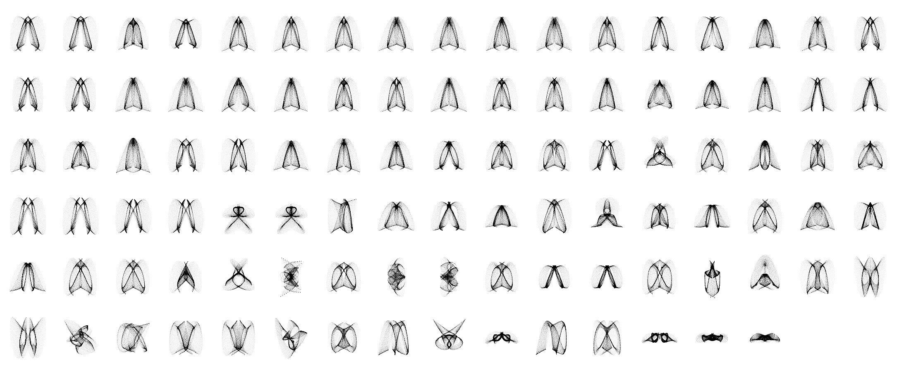

# Evolving harmonographs

This tutorial covers the implementation and application of a Genetic Algorithm on a generative design process. The goal is to evolve computer-generated drawings. In particular, we will be evolving [harmonographs](https://en.wikipedia.org/wiki/Harmonograph). To be precise, we will evolve a set of parameters that control the algorithmic drawing of harmonographs.

*Population of harmonographs evolved to resemble the letter A*

### Modules

The tutorial is structured in a series of modules:

1. Hello harmonograph
2. Random harmonographs
3. Class harmonograph
4. Population of harmonographs
5. Recombine harmonographs
6. Mutate harmonographs
7. Evaluate harmonographs
8. Tournament of harmonographs
9. Elite harmonographs
10. Automatic evolution of harmonographs
11. Interactive evolution of harmonographs

Each module consists of a Processing *sketch* that implements and demonstrates a particular evolutionary concept or mechanism. The modules are linked and sequenced to pave the way for the development of an evolutionary system at the end.

### Prerequisites

- Intermediate Processing (*e.g.* the ability to work with arrays and create classes)

### References

- Martins, T. (2021). *Automated Evolution for Design*. University of Coimbra, Portugal. [[link](https://estudogeral.sib.uc.pt/handle/10316/96431)]
- Shiffman, D. (2012). *The Evolution of Code*. In The Nature of Code (pp. 390–443). [[link](https://natureofcode.com/book/chapter-9-the-evolution-of-code/)]
- Lewis, M. (2008). *Evolutionary Visual Art and Design*. In J. Romero & P. Machado (Eds.), The Art of Artificial Evolution: A Handbook on Evolutionary Art and Music (pp. 3–37). Springer Berlin Heidelberg. [[link](https://link.springer.com/chapter/10.1007/978-3-540-72877-1_1)]
- Machado, P., Romero, J., & Manaris, B. (2008). *Experiments in Computational Aesthetics*. In J. Romero & P. Machado (Eds.), The Art of Artificial Evolution: A Handbook on Evolutionary Art and Music (pp. 381–415). Springer Berlin Heidelberg. [[link](https://link.springer.com/chapter/10.1007/978-3-540-72877-1_18)]

### Credits

This activity was created by [Tiago Martins](http://cdv.dei.uc.pt/people/tiago-martins/) and [Sérgio Rebelo](https://cdv.dei.uc.pt/authors/sergio-rebelo/) for the Computational Creativity for Design course unit of the master's degree in [Design and Multimedia](https://dm.dei.uc.pt) (Faculty of Sciences and Technology of the University of Coimbra).