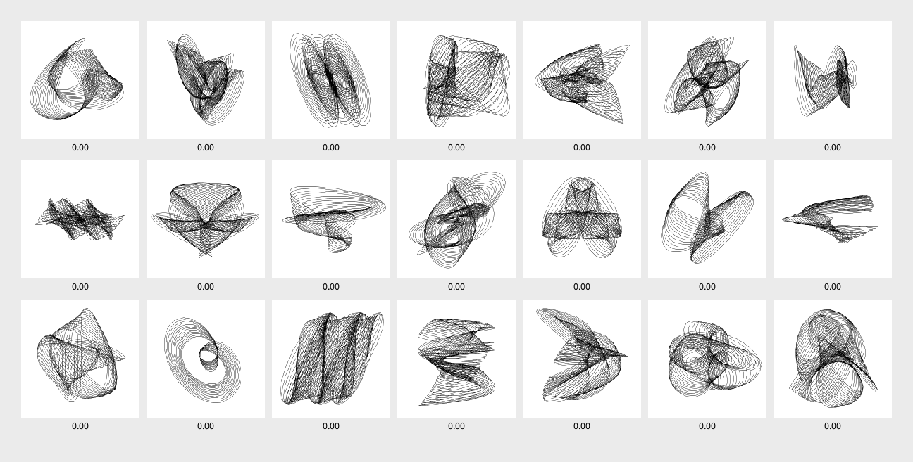

# Interactive Evolution of Harmonograph

This module demonstrates the use of an **Interactive Genetic Algorithm** to evolve harmonograph drawings, where users interactively perform the fitness assignment.

Users may assign the fitness of harmonographs in a continuous value between `0` and `1`. To do so, they should hover over their favourite individuals and use the arrow keyboard to increase or decrease their fitness. This algorithm is developed based on the previous proposed automatic approach, also implementing an elitist approach and a tournament-based selection.

### Challenges

- Implement and test and selection method based on the original Interactive Genetic Algorithm presented by Karl Sims in [Interactive Evolution of Dynamical Systems](https://www.karlsims.com/papers/DynamicalSystemsECAL92.pdf) (1992). In this work, users fitness the individuals only selecting the individuals that will survive and reproduce on the next generation. 
- Develop a hybrid fitness assignment strategy that assigns individuals' fitness based on the interactive evaluation of a small set of individuals.