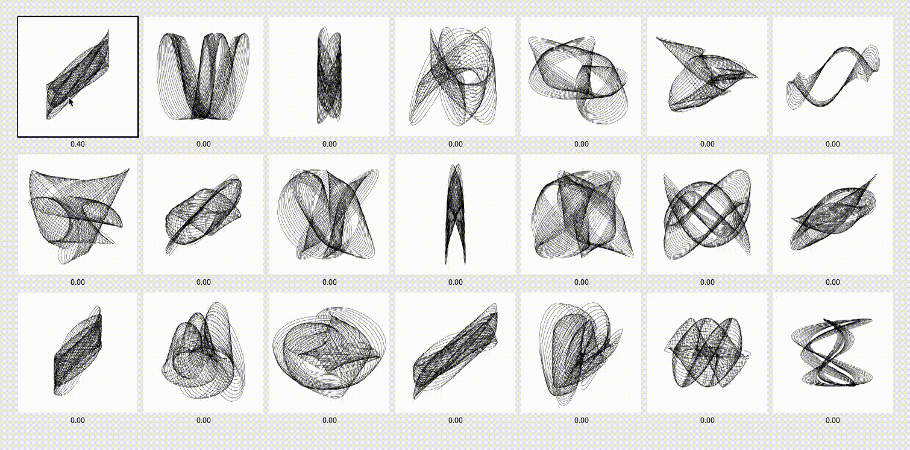

# Interactive Evolution of Harmonographs

This module demonstrates the use of an **Interactive Genetic Algorithm** to evolve harmonograph drawings, where users manually assign fitness to the drawings being evolved. This approach allows for subjective aesthetic evaluation and creative exploration of the design space.

*Population of harmonographs being manually evaluated and evolved*

## Key Features

- **User-Driven Evolution**: Manual fitness assignment through mouse and keyboard interaction
- **Real-Time Feedback**: Visual highlighting of evaluated individuals
- **Flexible Evaluation**: Multiple ways to assign fitness values (click, arrow keys)
- **Creative Exploration**: No target constraints, allowing for open-ended aesthetic evolution
- **Export Capabilities**: Save interesting individuals in multiple formats

## Architecture

### Core Classes

- **`Individual`**: Represents a harmonograph with multiple SuperFormula components
- **`PopulationInd`**: Manages population evolution with user-driven fitness assignment
- **`SuperFormula`**: Implements parametric curve generation using superformula equation
- **Interactive Interface**: Mouse and keyboard controls for fitness assignment

### Evolution Process

1. **Initialization**: Creates random population with default fitness values
2. **User Evaluation**: Manual fitness assignment through interaction
3. **Selection**: Roulette wheel selection based on user-assigned fitness
4. **Crossover**: OnePointFlexibleCrossover with configurable direction
5. **Mutation**: Controlled parameter mutation within valid ranges
6. **Generation**: Creates new population based on user preferences

## Parameters

- **Population Size**: 10 individuals (smaller for manageable evaluation)
- **Elite Size**: 0 (disabled for interactive evaluation)
- **Crossover Rate**: 0.5 (50% chance of crossover)
- **Mutation Rate**: 0.3 (30% chance of individual mutation)
- **Individual Mutation Rate**: 0.5 (50% chance of gene mutation)
- **Resolution**: 256x256 pixels for phenotype rendering

## Controls

Users can interact with the program using the following controls:

### Mouse Interaction
- **Click on individual**: Toggle fitness between high (10) and low (1) values
- **Hover**: Visual highlighting of individual under cursor

### Keyboard Controls
- **Arrow Keys** (while hovering over individual):
  - `↑`: Increase fitness (max 10)
  - `↓`: Decrease fitness (min 1)
  - `→`: Set to minimum fitness (1)
  - `←`: Set to no fitness (0)
- **`Enter` or `Space`**: Evolve to next generation
- **`r`**: Reset population with new random individuals
- **`e`**: Export currently hovered individual

## Visual Feedback

- **Hovered Individual**: Thin black border around individual under cursor
- **Evaluated Individuals**: Thick black border around individuals with fitness > 0
- **Fitness Display**: Numeric fitness values shown below each individual
- **Control Instructions**: On-screen help text at bottom of window

## Export Functionality

Individuals can be exported in multiple formats:
- **PNG**: High-resolution raster image (2000x2000)
- **PDF**: Vector format for scalable graphics
- **TXT**: Parameter values for reproduction

## Interactive Evolution Benefits

- **Subjective Evaluation**: Users can evaluate based on aesthetic preferences
- **Creative Discovery**: No target constraints allow for unexpected results
- **Real-Time Control**: Immediate feedback and adjustment capabilities
- **Exploration**: Users can guide evolution toward interesting directions

## Challenges

- **User Fatigue**: Manual evaluation can become tedious with large populations
- **Consistency**: User evaluation may be inconsistent over time
- **Scalability**: Limited to small populations due to evaluation overhead
- **Hybrid Approaches**: Combine automatic and interactive evaluation methods
- **User Interface**: Improve interaction design for better user experience

## Future Enhancements

- Implement user preference learning algorithms
- Add collaborative evaluation features
- Create aesthetic preference profiles
- Develop hybrid automatic/interactive evaluation
- Add real-time parameter adjustment controls